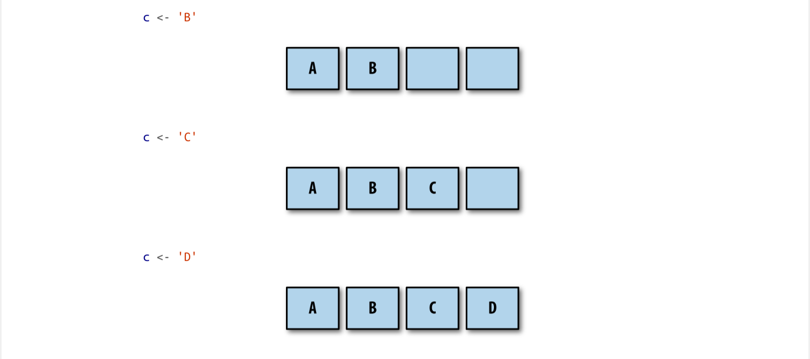
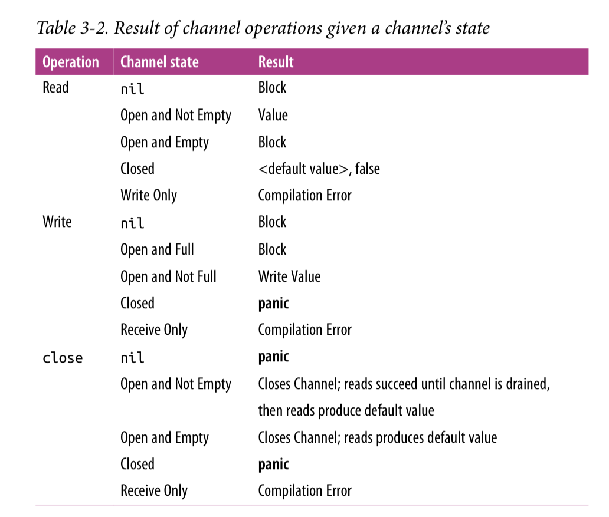

# Chapter 3
## Goroutines
Every program has at least 1 goroutine, the main goroutine, which is automatically created and started when the process begins.

A goroutine is a function that runs concurrently (not necessarily in parallel) alongside other code.
To start one, we can simply put the `go` keyword before a function

```
func man() {
    go sayHello()
}

func sayHello() {
    fmt.Println("hello")
}
```

it also works with anonymous functions:

```
go func() {
    fmt.Println("hello")
}()
```

Notice that we must invoke the anonymous function immediately to use the `go` keyword

Alternatively, we can assign the function to a variable and call the anonymous function like this:
```
sayHello := func() {
    fmt.Println("hello")
}
go sayHello()
```

Goroutines are not OS threads, and they are not exactly green threads (threads managed by the language's runtime).
They are a higher level of abstraction known as *coroutines*. Coroutines are concurrent subroutines (functions, closures, or methods in Go)
that are *non-preemtive* (they cannot be interrupted). Coroutines have multiple points throughout which allow for suspension or reentry.

Goroutines don't define their own suspension or reentry points, Go's runtime obersves the runtime behavior of goroutines and automatically suspends them when they block and then resumes them when they become unblocked.
They are implicitly concurrent constructs, but concurrency is not a property of a coroutine: something must host several coroutines simultaneously and give each an opportunity to execute, otherwhise, they wouldn't be concurrent!
This does not imply that coroutines are implicitly parallel.
It is possible to have several coroutines executing sequentially to give the illusion of parallelism, and in fact this happens all the time in Go

Go's mechanism for hosting goroutines is an implementation of what's called an M:M scheduler.
It maps M green threads to N OS threads. Goroutines are then scheduled onto the green threads.
When we have more goroutines than green threads available, the scheduler handles the distribution of the goroutines across the available threads and ensures that when these goroutines become blocked, other goroutines can be run.

Go follows a model of concurrency called the *fork-join* model.
The word *fork* refers to the fact that at any point in the program, it can split off a *child* branch of execution to be run concurrently with its *parent*.
The world *join* refers to the fact that at some point in the future, these concurrent branches of execution will join back together.
Where the child rejoins the parent is called a *join point*.

Join pints are what guarantee our program's correctness and remove the race condition. To create a join point, we have to synchronize the main goroutine and the child goroutine.
For example:

```
var wg sync.WaitGroup
sayHello := func() {
    defer wg.Done()
    fmt.Println("hello")
}
wg.Add(1)
go sayHello()
wg.Wait() //This is the join point
```

If you run a closure in a goroutine, does the closure operate on a copy of these variables, or the original reference?
```
var wg sync.WaitGroup
salutation := hello
wg.Add(1)
go func() {
    defer wg.Done()
    salutation = "welcome"
}()
wg.Wait()
fmt.Println(salutation)
```

The outcome in this case is "welcome"

Goroutines execute within the same address space they were created in.

```
var wg sync.WaitGroup
for _, salutation := range []string{"hello", "greetings", "good day"} {
    wg.Add(1)
    go func() {
        defer wg.Done()
        fmt.Println(salutation)
    }()
}
wg.Wait()
```

The outcome in this case is "good day" three times.

This happens because there is a high probability that the loop will exit before the goroutines are begun.
This means the *salutation* variable falls out of scope. Instead of this memory being garbage collected, Go runtime is observant enough to know that a reference to the salutation variable is still being held, and therefore will transfer the memory to the heap so that the goroutines can continue to access it.
As the loop will usually exit before any goroutines begin running, the value of salutation will be the last of the for loop ("good day"), which is the one copied to the heap and therefore showing the "good day" three times.

The proper way to write this loop is to pass a copy of salutation into the closure so that by the time the goroutine is run, it will be operating on the data from its iteration of the loop:
```
var wg sync.WaitGroup
for _, salutation := range []string{"helo", "greetings", "good day"} {
    wg.Add(1)
    go func(salutation string) {
        defer wg.Done()
        fmt.Println(salutation)
    }(salutation)
}
wg.Wait()
```

As we pass the current iteration variable to the closure, a copy of the string struct is made, thereby ensuring that when the goroutine is run, we refer to the proper string.

Goroutines are given a few kilobytes, which is almost always enough, when it isn't, the run-time grows (and shrinks) the memory for storing the stack automatically.

### The sync Package
#### WaitGroup
WaitGroup is a great way to wait for a set of concurrent operations to complete when we either don't care about the result of the concurrent operation, or we have other means of collecting their results.
If none of those conditions are true, we should use channels and a select statement instead.

Example of using a WaitGroup to wait for goroutines to complete:
```
var wg sync.WaitGroup

wg.Add(1)
go func() {
    defer wg.Done()
    fmt.Println("1st goroutine sleeping...")
    time.Sleep(1)
}()

wg.Add(1)
go func() {
    defer wg.Done()
    fmt.Println("2st goroutine sleeping...")
    time.Sleep(2)
}()

wg.Wait()
fmt.Println("All goroutines complete.")
```

We use `wg.Wait()` with an argument of 1 to indicate that one goroutine is beginning.
We use `defer wg.Done()` to ensure that bfore we exit the goroutine's closure, we indicate to the WaitGroup that we've exited.
Finally, we call `wg.Wait()` to block the main goroutine untill all goroutines have indicated that they have exited.

We have to call `Add()` outside the goroutine itself, otherwise, we would introduce a race condition.
We should couple calls to `Add()` as close as possible to the goroutines they're helping to track. We can also use it to track a group of goroutines all at once.


#### Mutex and RWMutex (mutually exclusive)
Mutex stands for "mutual exclusion", and is a way to guard critical sections of your program. A critical section is an area of our program that requires exclusive access to a shared resource.
A Mutex provides concurrent-safe way to express exclusive access to these shared resources.

```
var count int
var lock sync.Mutex

increment := func() {
    lock.Lock()
    defer lock.Unlock()
    count++
    fmt.Println("Incrementing: %d\n", count)
}
```

Using `lock.Lock()` we request the exclusive use of the critical section, in this case the count variable, guarded by a Mutex, lock.
Using `lock.Unlock()` we indicate that we are done with the critical section lock is guarding. Using `defer`to call `Unlock`is a very common idiom when using Mutex to ensure the call always happens, even when panicking. Not doing so will probably cause your program to have a deadlock

Critical sections are so named because they reflect a bottleneck in our program. It is expensive to enter and exit a critical section, and generally people attempt to minimize the time spent in critical sections.
One strategy is to check if we need all the processes to read *and* write to this memory. If not, we can take advantage of `sync.RWMutex`.

`sync.RWMutex` is conceptually the same as a `Mutex`, it guards access to memory, however, `RWMutex` gives us a bit more control over the memory. We can request a lock for reading, in which case we will be granted access unless the lock is being held for writing.
Example:

It is usually advisable to use RWMutex instead of Mutex when it logically makes sense.

### Cond
```
c := sync.NewCond(&sync.Mutex{})
c.L.Lock()
for conditionTrue() == false {
    c.Wait()
}
c.L.Unlock()
```

- `sync.NewCond` takes any type that satisfies the sync.Locker interface.
- We call `c.L.Lock()`, this is necessary because the call to `Wait()` automatically calls `Unlock` on the `Locker` when entered
- When the `Wait()` exits, it locks the `Locker` lock

A call to `Wait` doesn't just block, it *suspends* the current goroutine, allowing other goroutines to run on the OS thread.

Upon entering `Wait`, `Unlock` is called on the Cond variable's `Locker`, and upon exiting `Wait`, `Lock` is called on the Cond variable's `Locker`. Even though it loookes like we are holding this lock the entier time while we wait for the condition to ocurr, that's not actually the case.

`Signal()` is a method from `Cond` that maintains a FIFO list of goroutines waiting to be signaled. Signal finds the goroutine that's been waiting the longest and notifies that.

`Broadcast()` sends a signal to all goroutines that are waiting.

#### Once

`once.Do()` will execute the function passed in exactly once. Always once.
It can cause a deadlock if we call a function using once that calls a function that already has been called by once.

#### Pool
`Pool` is a concurrent-safe implementation of the object pool pattern. It's commonly used to constrain the creation of things that are expensive (like database connections) so a fixed number of them are ever created, but an indeterminate number of operations can still request access to these things.
It is safe to use `sync.Pool` by multiple goroutines.

`Pool` primary interface is its `Get` method. When called, `Get` will first check whether there are any instances available within the pool to return to the caller, and if not, call its `New` member variable to create a new one.
When finished, callers call `Put` to place the instance they were working with back in the pool for use by other processes.

Why use `Pool` instead of instantiating object as we go? Because the pool will let us reuse this objects, instead of the GC removing them and us creating them again.

Another use of `Pool` is for warming a cache of pre-allocated objects for operations that must run as quickly as possible.

Rules for using `Pool` correctly:

- When instantiating sync.Pool, give it a New member variable that is thread-safe
when called.

- When you receive an instance from Get, make no assumptions regarding the
state of the object you receive back.

- Make sure to call Put when you’re finished with the object you pulled out of the
pool. Otherwise, the Pool is useless. Usually this is done with defer.

- Objects in the pool must be roughly uniform in makeup.

### Channels
`Channel` is one of the synchronization primitives in Go derived from Hoare's CSP. While it can be used to synchronize access to memory, it is best used to communicate information between goroutines.

Creating a channel is very simple:
```
var dataStream chan interface{}
dataStream = make(chan interface{})
```

This example defines a `channel` called *dataStream* upon which any value can be written or read. Channels can also be declared to only support a unidirectional flow of data.

To declare a unidirectional channel, include the <- operator. To both declare and instantiate a channel that can only read, place the <- operator on the left hand side:
```
var dataStream <- chan interface{}
dataStream := make(<-chan interface{})
```

To declare and create a channel that can only send, you place the <- operator on the right-hand side:
```
var dataStream chan<- interface{}
dataStream := make(chan<- interface{}
```

Unidirectional channels are not often seen instantiated, but we can often see them used as a function parameter and return type, which is very useful.
This is possible because Go will implicitly convert bidirectional channels to unidirectional channels when needed.
```
var receiveChan <-chan interface{}
var sendChan chan<- interface{}
dataStream := make(chan interface{})
// Valid statements:
receiveChan = dataStream
sendChan = dataStream
```

Sending is done by placing the <- operator to the right of a channel, and receiving is done by placing the <- operator to the left of the channel. Another way to think of this is the data flows into the variable in the direction the arrow points.
```
stringStream := make(chan string)
go func() {
    stringStream <- "Hello channels!"
}()
fmt.Println(<-stringStream)
```

This produces:
```
Hello channels!
```

It is an error to try and write a value onto a read-only channel, and an error to read a value from a write-only channel. Go compiler will let us know that we are doing something ilegal:
```
invalid operation: <-writeStream (receive from send-only type
chan<- interface {})
invalid operation: readStream <- struct {} literal (send to receive-only
type <-chan interface {})
```

Go channels are said to be *blocking*. Any goroutine that attempts to write to a channel that is full will wait until the channel has been emptied, and any goroutine that attempts to read from a channel that is empty will wait until at least one item is placed on it.
This can cause deadlocks if we don't structure our program correctly.

The recieving form of the <- operator can also optionally return two values like so:
```
stringStream := make(chan string)
go func() {
    stringStream <- "Hello channels!"
}()
salutation, ok := <-stringStream
fmt.Printf("(%v): %v", ok, salutation)
```
Which will print:
```
(true): Hello channels!
```

The second return value is a way for a read operation to indicate whether the read off the channel was a value generated by a write elsewhere in the process, or a default value generated from a closed channel.
Closing a channel is useful to help downstream processes know when to move on, exit, reopen communications on a new or different channel, etc...

To close a channel we use the `close` keyword:
```
valueStream := make(chan interface{})
close(valueStream)
```

Interestingly, we can read from a closed channel as well:
```
intStream := make(chan int)
close(intStream)
integer, ok := <- intStream
fmt.Printf("(%v): %v", ok, integer)
```

This will produce:
```
(false): 0
```

We can loop over channels too:
```
intStream := make(chan int)
go func() {
    defer close(intStream)
    for i := 1; i <=5; i++ {
        intStream <- i
    }
}()

for integer := range intStream {
    fmt.Printf("%v ", integer)
}
```

The loop doesn't need an exit criteria, it is managed for us to keep the loop concise.

Closing a channel is also a way to signal multiple goroutines simultaneously as a closed channel can be read infinite times. It is cheaper and faster to close a channel that to perform n writes.

We can also create *buffered channels* which are channels that are given a *capacity* when they are instantiated.
```
var dataStream chan interface{}
dataStream = make(chan interface{}, 4)
```

We created a channel with a capacity of 4, this means that we can place four things onto the channel regardless of wether it's being read from.

Unbuffered channels are also defined in terms of buffered channels. An unbuffered channel is simply a buffered channel created with a capacity of 0.
```
a := make(chan int)
b := make(chan int, 0)
```

Both channels are int channels with a capacity of zero.

Writes to a channel block if a channel is full, and reads from a channel block if a channel is empty.
"Full" and "empty" are functions of the capacity, or buffer size. An unbuffered channel has a capacity of zero and so it's already full before any writes.

A buffered channel with no receivers and a capacity of four would be full after four writes, and block on the fifth write since it has nowhere else to place the fifth element. 

Buffered channels are an in-memory FIFO queue for concurrent processes to communicate over.

Example:
```
c := make(chan rune, 4)
```

This creates a channel with a buffer that has four slots, like so:


Now, let’s write to the channel: `c <- 'A'`

When this channel has no readers, the A rune will be placed in the first slot in the
channel’s buffer, like so:


Each subsequent write onto the buffered channel (again, assuming no readers) would
fill up the remaining slots in the buffered channel, like so:



After four writes, our buffered channel with a capacity of four is full. What happens if
we attempt to write to the channel again?
```
c <- 'E'
```


The goroutine performing this write is blocked! The goroutine will remain blocked
until room is made in the buffer by some goroutine performing a read. Let’s see what
that looks like:
```
<-c
```


As you can see, the read receives the first rune that was placed on the channel, A, the
write that was blocked becomes unblocked, and E is placed on the end of the buffer.


If the buffer is empty and the receiver is already waiting, the sender data will be sent directly to the receiver without entering the buffer.

Buffered channels can be useful in certain situations, but we should create them with care. They can easily become a premature optimization and also hide deadlocks by making them more unlikely to happen.

The default value for channels is `nil`.

What happens if we try to read a nil channel?:
```
var dataStream chan interface{}
<-dataStream
```

it will panic with:
```
fatal error: all goroutines are asleep - deadlock!
goroutine 1 [chan receive (nil chan)]:
main.main()
/tmp/babel-23079IVB/go-src-23079O4q.go:9 +0x3f
exit status 2
```

A deadlock! This indicates that reading from a `nil` channel will block (although not necessarily deadlock) a program.
What about writes?
```
var dataStream chan interface{}
dataStream <- struct{}{}
```

This produces:
```
fatal error: all goroutines are asleep - deadlock!
goroutine 1 [chan send (nil chan)]:
main.main()
/tmp/babel-23079IVB/go-src-23079dnD.go:9 +0x77
exit status 2
```

What happens if we try to close a `nil` channel?
```
var dataStream chan interface{}
close(dataStream)
```

this produces:
```
panic: close of nil channel
goroutine 1 [running]:
panic(0x45b0c0, 0xc42000a160)
/usr/local/lib/go/src/runtime/panic.go:500 +0x1a1
main.main()
/tmp/babel-23079IVB/go-src-230794uu.go:9 +0x2a
exit status 2
```

This is probably the worst outcome, a panic. We have to ensure the channels we are working with are always initialized first.

Table of channel operations and outcomes:


To build robust and stable logic with channels, we should put them in the right context, which is, assign channel *ownership*.
We define ownership as being a goroutine that instantiates, writes and closes a channel.

Unidirectional channel declarations are the tool that will allow us to distinguish between goroutines that own channels and those that only utilize them:
channel owners have a write-access view into the channel (chan or chan<-), and channel utilizers only have a read-only view into the channel (<-chan).

Channel owners should
1. Instantiate the channel.
2. Perform writes, or pass ownership to another goroutine.
3. Close the channel.
4. Encapsulate the previous three things in this list and expose them via a reader
   channel.

By assigning these responsibilities to channel owners, a few things happen:
- Because we’re the one initializing the channel, we remove the risk of deadlocking
by writing to a nil channel.
- Because we’re the one initializing the channel, we remove the risk of panicing by
closing a nil channel.
- Because we’re the one who decides when the channel gets closed, we remove the
risk of panicing by writing to a closed channel.
- Because we’re the one who decides when the channel gets closed, we remove the
risk of panicing by closing a channel more than once.
- We wield the type checker at compile time to prevent improper writes to our
channel.

Now, as a consumer of a channel, I only have to worry about two things:

- Knowing when a channel is closed.
- Responsibly handling blocking for any reason.

The first point can easily be addressed by examining the second return value from the read operation.
The second point is much harder to define because it depends on what we want to do, time out, stop reading, or maybe block for the lifetime of the process.

The important thing is that as a consumer you should handle the fact that reads can and will block.
```
chanOwner := func() <-chan int {
    resultStream := make(chan int, 5)
    go func() {
        defer close(resultStream)
        for i := 0; i <= 5; i++ {
            resultStream <- i
        }
    }()

    return resultStream
}
resultStream := chanOwner()
for result := range resultStream {
    fmt.Printf("Received: %d\n", result)
}
fmt.Println("Done receiving!")
```


### The select Statement
The `select` statement is the glue that binds channels together. It's how we're able to compose channels together in a program to form larger abstractions.
```
var c1, c2 <-chan interface{}
var c3 chan<- interface{}
select {
case <- c1:
    // Do something
case <- c2:
    // Do something
case c3<- struct{}{}:
    // Do something
}
```

Case statements in a `select` block aren't tested sequentially and execution won't automatically fall through if none of the criteria are met.

All channel reads and writes are considered "simultaneously" to see if any of them are ready. Populated or closed channels in the case of reads, and channels that are not at capacity in the case of writes. If none of the channels are ready, the entire `select` statement blocks.

Go will try to distribute the reads from different cases evenly, that is, 50/50.

If you want to timeout after an amount of time, you can do:
```
var c <- chan int
select {
case <-c:
case <-time.After(1 * time.Second):
    fmt.Println("Timed out.")
}    
```

This will print:
```
Timed out.
```

time.After returns a channel that will send the current time after the duration you provide it.

We also have the option of putting a default case:
```
start := time.Now()
var c1, c2 <-chan int
select {
case <-c1:
case <-c2:
default:
    fmt.Printf("In default after %v\n\n", time.Since(start))
}
```

This will produce:
```
In default after 1.421µs
```

Usually we see `default` clauses used in conjunction with a for-select loop. This allows a goroutine to make progress on work while waiting for another goroutine to report a result:
```
done := make(chan interface{})
go func() {
time.Sleep(5*time.Second)
close(done)
}()
workCounter := 0
loop:
for {
    select {
    case <-done:
        break loop
    default:
    }
    // Simulate work
    workCounter++
    time.Sleep(1*time.Second)
}
fmt.Printf("Achieved %v cycles of work before signalled to stop.\n", workCounter)
```

This produces:
```
Achieved 5 cycles of work before signalled to stop.
```

There is also a special case for empty `select` statements: `select` statements with no case clauses:
```
select {}
```
This statements will simply block forever.

### The GOMAXPROCS Lever
This setting controls the number of OS threads that will host so-called "work queues".
Prior to Go 1.5 GOMAXPROCS was always set to 1, and people would always do the following:
```
runtime.GOMAXPROCS(runtime.NumCPU())
```

Almost all developers want to take advantage of all the cores on the machine their process is running in. Because of this, in subsequent Go versions it is now automatically set to the number of logical CPUs on the host machine.
