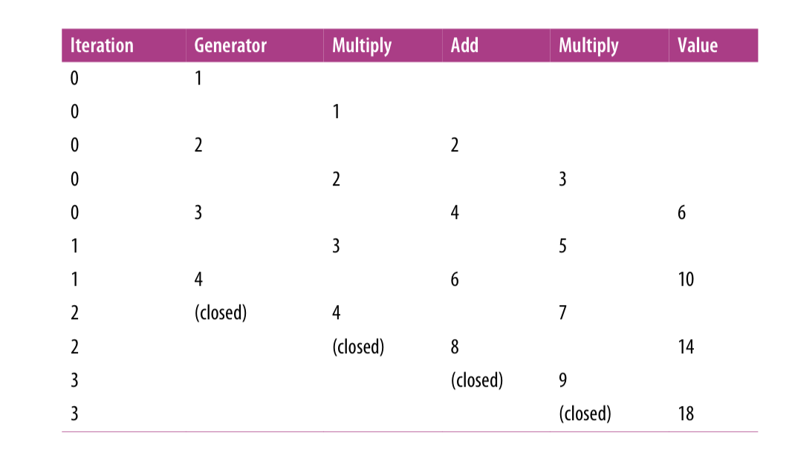
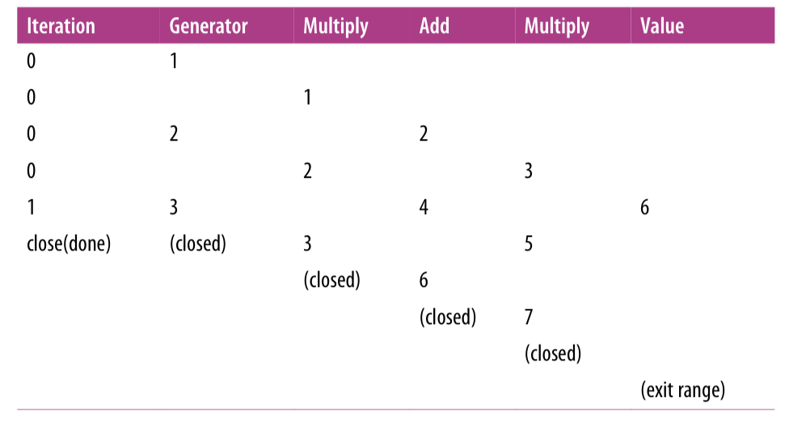

# Chapter 4
## Concurrency Patterns in Go
### Confinement
When working with concurrent code, there are a few options for safe operation. We have gone over two of them:
- Synchronization primitives for sharing memory (eg: sync.Mutex)
- Synchronization via communicating (eg: channels)

There are a couple of other options that are implicitly safe within multiple concurrent processes
- immutable data
- Data protected by confinement

Immutable data is implicitly concurrent-safe, each concurrent process may operate on the same data, but it may not modify it. To create new data, it must create a copy of the data with modifications. This can lead to faster programs if it leads to smaller critical sections.
In Go, we can achieve this by writing code that utilizes copies of values instead of pointers to values in memory.

Confinement is the idea of ensuring information is only ever available from *one* concurrent process.

There are two kinds of confinement possible: ad hoc and lexical.

Ad hoc confinement is when you achieve confinement through a convention. Sticking to convention is difficult to achieve on projects of any size, here's an example of ad hoc confinement:
```go
data := make([]int, 4)
loopData := func(handleData chan<- int) {
    defer close(handleData)
    for i := range data {
        handleData <- data[i]
    }
}
handleData := make(chan int)
go loopData(handleData)

for num := range handleData {
    fmt.Println(num)
}
```

Here the data slice of ints is available from both the *loopData* function and the loop over the *handleData* channel. By convention, we are only accessing it from the *loopData* function, but if many people touch the code, it might end up failing.

Lexical confinement involves using lexical scope to expose only the correct data and concurrency primitives for multiple concurrent processes to use. It makes it impossible to do the wrong thing.

```go
chanOwner := func() <-chan int {
    results := make(chan int, 5)
    go func() {
        defer close(results)
        for i := 0; i <= 5; i++ {
            results <- i
        }
    }()
    return results
}

consumer := func(results <-chan int) {
    for result := range results {
        fmt.Printf("Received: %d\n", result)
    }
    fmt.Println("Done receiving!")
}

results := chanOwner()
consumer(results)
```

In this example, we instantiate a channel within the lexical scope of the *chanOwner* function. It *confines* the write aspect of this channel to prevent other goroutines from writing to it.

The consumer receives only the read part of the channel. This confines the main goroutine to a read-only view of the channel.

Setup this way, it iss impossible to utilize the channels in this small example.

Let's make an example with a data structure which is not concurrent-safe, an instance of `bytes.Buffer`
```go
printData := func(wg *sync.WaitGroup, data []byte) {
    defer wg.Done()
    var buff bytes.Buffer
    for _, b := range data {
        fmt.Fprintf(&buff, "%c", b)
    }
    fmt.Println(buff.String())
}

var wg sync.WaitGroup
wg.Add(2)
data := []byte("golang")
go printData(&wg, data[:3])
go printData(&wg, data[3:])

wg.Wait()
```

As we instantiate the bytes.Buffer inside the function, it is confined, also we only ask for read data so there won't be any sync issues.

The good thing about confinement compared to synchronization is that it improves performance and reduces cognitive load on developers.

### The for-select Loop
```go
for { //Either loop infinitely or range over something
    select {
        //Do sth with channels
    }
}
```

There are a couple of different scenarios when we'll see this pattern pop up:

*Sending iteration variables out on a channel*

Sometimes we want to convert something that can be iterated over into values on a channel:
```go
for _, s := range []string{"a", "b", "c"} {
    select {
    case <-done:
        return
    case stringStream <- s:
    }
}
```

*Looping infinitely waiting to be stopped*

It is very common to create goroutines that loop infinitely until they are stopped.
There are a couple of variations of this one, its purely a stylistic preference.

The first variation keeps the `select` statement as short as possible:
```go
for {
    select {
    case <-done:
        return
    default:
    }
    
    //Do non-preemtable work
}
```

If the done channel isn't closed, we'll exit the `select` statement and continue on to the rest of our for loop's body

The second variation embeds the work in a `default` clause of the `select` statement.
```go
for {
    select {
    case <-done:
        return
    default:
        //Do non-preemtable work
    }
}
```
When we enter the `select` statement, if the `done` channel hasn't been closed, we'll execute the `default` clause instead.

### Preventing Goroutine leaks
Goroutines are cheap, but they *do* cost resources, and they are not garbage collected by the runtime. How do we ensure they are cleaned up?

A goroutine has a few paths to termination:
- When it has completed its work.
- When it cannot continue its work due to an unrecoverable error.
- When it's told to stop working.

We get the first two paths for free, but what about work cancellation?

Let's start with an example of a goroutine leak:
```go
doWork := func(strings <-chan string) <-chan interface{} {
    completed := make(chan interface{})
    go func() {
        defer fmt.Println("doWork exited.")
        defer close(completed)
        for s := range strings {
            // Do something interesting
            fmt.Println(s)
        }
    }()
    return completed
}

doWork(nil)
// Perhaps more work is done here
fmt.Println("Done.")
```

Here we pass a nil channel into `doWork`. Therefore, the `strings` channel will never actually get any strings written onto it, and the goroutine containing `doWork` will remain in memory for the lifetime of this process.

In the worst case, the main goroutine could continue to spin up goroutines throughout its life, causing creep in memory utilization.

The best way to successfully mitigate this is to establish a signal between the parent goroutine and its children that allows the parent to signa cancellation to its children. This signal is usually a read-only channel named `done`, and its sent as the first parameter.
```go
doWork := func(
    done <-chan interface{},
    strings <-chan string,
) <-chan interface{} {
    terminated := make(chan interface{})
    go func() {
        defer fmt.Println("doWork exited.")
        defer close(terminated)
        for {
            select {
                case s := <-strings:
                    // Do something interesting
                    fmt.Println(s)
                case <-done:
                return
            }
        }
    }()
    return terminated
}

done := make(chan interface{})
terminated := doWork(done, nil)

go func() {
    // Cancel the operation after 1 second.
    time.Sleep(1 * time.Second)
    fmt.Println("Canceling doWork goroutine...")
    close(done)
}()

<-terminated
fmt.Println("Done.")
```

We use a goroutine to cancel the operation after 1 second. Now even when sending nil, the goroutine will exit and we will have elimintaed our goroutine leak.

We can stipulate a convention. If a goroutine is responsible for creating a goroutine, it is also responsible for ensuring it can stop the goroutine.

### The or-channel
When we want to combine one or more `done` channels into a single channel that closes if any of its components channels close, we could write a `select` statement. However, there's a one-liner to combine these channels together, the *or-channel* pattern.

```go
var or func(channels ...<-chan interface{}) <-chan interface{}
or = func(channels ...<-chan interface{}) <-chan interface{} {
    switch len(channels) {
        case 0: // Termination criteria, when slice empty, return nil channel
            return nil
        case 1: //If only 1 channel, return the channel
            return channels[0]
    }
    
    orDone := make(chan interface[])
    go func() { //Here recursion happens
        defer close(orDone)
        
        switch len(channels) {
        case 2: //As all recursive calls will have at least 2 channels, we optimize here for calls to "or" with only two channels to not add another level of deepness
            select {
            case <-channels[0]:
            case <-channels[1]:
            }
        default: //We recursively create an or-channel from all the channels in our slice after the third index, and then select from it.
            select {
            case <-channels[0]:
            case <-channels[1]:
            case <-channels[2]:
            case <-or(append(channels[3:], orDone)...):
            }
        }
    }()
    
    return orDone
}
```

The idea here is that we either have 0 channels, in which case we return a nil channel, or 1 channel and we return it, this is the main exit condition of this recursive function.

We also have the fact that the selects in the goroutine will return when a goroutine returns. If we have more than 2 goroutines, we will make a recursive call with or again, until one closes.

Example:
```go
sig := func(after time.Duration) <-chan interface{}{
    c := make(chan interface{})
    go func() {
        defer close(c)
        time.Sleep(after)
    }()
    return c
}

start := time.Now()
<-or(
    sig(2*time.Hour),
    sig(5*time.Minute),
    sig(1*time.Second),
    sig(1*time.Hour),
    sig(1*time.Minute),
)
fmt.Printf("done after %v", time.Since(start))
```

If we run this program, we'll get:
`done after 1.000216772s`

We get this at the cost of additional goroutines O(N)

### Error Handling
With concurrent processes, its complex to know who is responsible for handling an error. As we are inside an independent part, we can't handle errors directly, a bad example would be:
```go
checkStatus := func(
    done <-chan interface{},
urls ...string,
) <-chan *http.Response {
    responses := make(chan *http.Response)
    go func() {
        defer close(responses)
        for _, url := range urls {
            resp, err := http.Get(url)
            if err != nil {
                fmt.Println(err)
                continue
            }
            select {
            case <-done:
                return
            case responses <- resp:
            }
        }
    }()
    return responses
}

done := make(chan interface{})
defer close(done)

urls := []string{"https://www.google.com", "https://badhost"}
for response := range checkStatus(done, urls...) {
    fmt.Printf("Response: %v\n", response.Status)
}
```

Here, the Goroutine simply prints a message and hopes that someone will take care of it. This is a BAD PATTERN.

We should separate concerns. Our concurrent processes should send their errors to another part of our program that has complete information about the state of our program and can make a more informed decision about what to do. Example:

```go
type Result struct {
    Error error
    Response *http.Response
}

checkStatus := func (done <-chan interface{}, urls ...string) <-chan Result {
    results := make(chan Result)
    go func() {
        defer close(results)
        for _, url := range urls {
            var result Result
            resp, err := http.Get(url)
            result = Result{Error: err, Response: resp}
            select {
            case <-done:
            return
            case results <- result:
            }
        }
    }()
    return results
}

done := make(chan interface{})
defer close(done)

urls := []string{"https://www.google.com", "https://badhost"}
for result := range checkStatus(done, urls...) {
    if result.Error != nil {
        fmt.Printf("error: %v", result.Error)
        continue
    }

    fmt.Printf("Response: %v\n", result.Response.Status)
}

```

Here we create a type that contains both the `*http.Response` and the `error`. Then, we use it to store both the result and if there has been any error.

We can also make it stop trying to check for stauts if three or more errors occur:
```go
done := make(chan interface{})
defer close(done)

errCount := 0
urls := []string{"a", "https://www.google.com", "b", "c", "d"}
for result := range checkStatus(done, urls...) {
    if result.Error != nil {
        fmt.Printf("error: %v\n", result.Error)
        errCount++
        if errCount >= 3 {
            fmt.Println("Too many errors, breaking!")
            break
        }
        continue
    }
fmt.Printf("Response: %v\n", result.Response.Status)
}
```

This code produces:
```bash
error: Get a: unsupported protocol scheme ""
Response: 200 OK
error: Get b: unsupported protocol scheme ""
error: Get c: unsupported protocol scheme ""
Too many errors, breaking!
```

### Pipelines
A *pipeline* is just another tool we can use to form an abstraction in our system. It is particularly useful for streams or batches of data.

A pipeline is a series of things that take data in, perform an operation on it, and pass the data back out. We call each of these operations a *stage* of the pipeline.

Separating the concerns of each stage provides numerous benefits, we can modify they idependently, mix and match how they are combined, process each stage concurrent to upstream or downstream stages, and we can *fan-out*, or *rate-limit* portions of your pipeline.

This function could be considered a pipeline stage:
```go
multiply := func(values []int, multiplier int) []int {
	multipliedValues := make([]int, len(values))
    for i, v := range values {
        multipliedValues[i] = v * multiplier
    }
    return multipliedValues
}
```
This function takes a slice of integers in with a multiplier, loops through them multiplying as it goes, and returns a new transformed slice out. Let's create another stage:
```go
add := func(values []int, additive int) []int {
	addedValues := make([]int, len(values))
	for i, v := range values {
		addedValues[i] = v + additive
    }
	return addedValues
}
```
This one just creates a new slice and adds a value to each element.

Now we can combine them in the following way:
```
ints := []{1, 2, 3, 4}
for _, v := range add(multiply(ints, 2), 1) {
    fmt.Println(v)
}
```
This code produces:
```bash
3
5
7
9
```

We could combine both *add* and *multiply* within the *range* clause easily because we constructed them to have the properties of a pipeline stage:

- A stage consumes and returns the same type
- A stage must be reified by the language so that it may be passed around. Functions in Go are reified and fit this purpose nicely.

Each stage is taking a slice of data and returning a slice of data. These stages are performing what we call *batch processing*. This means that they operate on chunks of data all at once instead of one discrete value at a time. There is another type of pipeline stage that performs *stream processing*, this means that the stage receives and emits one element at a time.

As each stage has to make a new slice of equal length to store the results of its calculations, the memory footprint of our program at any one time is double the size of the slice we send into the start of our pipeline, let's convert our stages to be stream oriented and see what that looks like:
```go
multiply := func(value, multiplier int) int {
    return value * multiplier
}

add := func(value, additive int) int {
    return value + additive
}

ints := []int{1, 2, 3, 4}
for _, v := range ints {
    fmt.Println(multiply(add(multiply(v, 2), 1), 2))
}
```

Each stage is receiving and emitting a discrete value, and the memory footprint of our program is back down to only the size of the pipeline's input, but we are instantiating our pipeline for every iteration, although it's cheap to make function calls, we are making three functions calls for each iteration.

### Best Practices for Constructing Pipelines
Channels are uniquely suited to constructing pipelines in Go because they fulfill all of our basic requirements.

They can receive and emit values, can safely be used concurrently, can be ranged over and are reified by the language.
```go
generator := func(done <-chan interface{}, integers ...int) <-chan int {
	intStream := make(chan int, len(integers))
	go func() {
	    defer close(intStream)
		for _, i := range integers {
			select {
            case <-done:
                return
            case intStream <- i:
            }
        }       
    }()
	return intStream
}

multiply := func(
	done <-chan interface{},
	intStream <-chan int,
    multiplier int,
) <-chan int {
	multipliedStream := make(chan int)
    go func() {
		defer close(multipliedStream)
		for i := range intStream {
            select {
            case <-done:
            return
            case multipliedStream <- i*multiplier:
            }
        }
    }   
}

add := func(
    done <-chan interface{},
    intStream <-chan int,
    additive int,
) <-chan int {
    addedStream := make(chan int)
    go func() {
        defer close(addedStream)
        for i := range intStream {
            select {
            case <-done:
                return
            case addedStream <- i+additive:
            }
        }
    }()
    return addedStream
}

done := make(chan interface{})
defer close(done)

intStream := generator(done, 1, 2, 3, 4)
pipeline := multiply(done, add(done, multiply(done, intStream, 2), 1), 2)

for v := range pipeline {
    fmt.Println(v)
}
```

Let's take a look closely:
```go
done := make(chan interface{})
defer close(done)
```

The first thing our program does is create a *done* channel and call close on it in a *defer* statement. This is to ensure our program exists cleanly and never leaks goroutines.

```go
generator := func(done <-chan interface{}, integers ...int) <-chan int {
	intStream := make(chan int, len(integers))
	go func() {
		defer close(intStream)
		for _, i := range integers {
			select {
			case <-done:
                return
            case intStream <- i:
            }   
        }
    }()
	return intStream
}

// ...

initStream := generator(done, 1, 2, 3, 4)
```

The *generator* function takes in a variadic slice of integers, constructs a buffered channel of integers with a length equal to the incoming integer slice, starts a goroutine and returns the constructed channel. Then, on the goroutine that was created, *generator* ranges over the variadic slice that was passed in and sends the slices' values on the channel it created.

In a nutshell, the *generator* function converts a discrete set of values into a stream of data on a channel. Aptly, this type of function is called a *generator*. We usually see this frequently when working with pipelines because at the beginning of the pipeline, we'll always have some batch of data that we need to convert to a channel.

```go
pipeline := multiply(done, add(done, multiply(done, intStream, 2), 1), 2)
```

It's the same pipeline we have been working with all along. For a stream of numbers, we multiply them by two, add one, and then multiply the result by two.

This way is better than the first pipeline we did because:

We are using channels, it allows us to use a range statement to extract the values, and at each stage safely execute concurrently because our inputs and outputs are safe in concurrent contexts.

Each stage of the pipeline is executing concurrently, any stage only need is to wait for its inputs, and to be able to send its outputs.

Here is a table demonstrating how each of the values in the system will enter each channel, and when the channels will be closed. Iteration is the base-zero count of what iteration of the for loop we're on, and the value for each column is the value as it comes into the pipeline stage:


And here is a table demonstrating how calling close will make all other stages to close:


Closing the `done` channel makes the whole pipeline cancellable because every stage is written so it can stop in both situations where it might block.

Each pipeline stage usually does three things:

1. Receive a value from its input channel
2. Create or transform a value
3. Send the value to its output channel

There are two important cancellation points:

#### 1. Receiving from the input channel

Most stages receive values with:

`for v := range inputStream`

This loop ends when `inputStream` is closed.

So if the previous stage exits and closes its output channel, the current stage stops receiving and exits too.

This creates a cascade:

`done` closes → first stage exits → first output channel closes → next stage's range exits → next output channel closes → and so on.

#### 2. Sending to the output channel

Sending to a channel can block if no downstream stage is reading.

So each send is wrapped in a `select`:

`select {
case <-done:
    return
case outputStream <- value:
}`

This means the stage can still exit if cancellation happens while it is blocked trying to send.

#### Value creation also matters

If creating the value is almost instant, like ranging over a slice of integers, it does not need special cancellation handling.

But if creating the value is slow, such as reading a file, calling an API, doing expensive computation, or waiting on I/O, that operation should also be cancellable.

Otherwise the goroutine could still be stuck creating the value even after `done` is closed.

#### Final idea

A pipeline is safely cancellable when every stage follows this rule:

- It exits when its input channel is closed.
- It closes its own output channel when it exits.
- It guards blocking sends with `select` and `done`.
- Any slow value-creation work is also cancellable.

Because every stage follows the same pattern, cancellation propagates through the whole pipeline.

### Some Handy Generators
Generators are functions that convert values, functions, or repeated patterns into channels.

They are useful because they let the rest of the pipeline work with streams instead of discrete values.

Common examples:

- `repeat`: repeatedly emits the same values until `done` is closed.
```go
repeat := func(
    done <-chan interface{},
    values ...interface{},
) <-chan interface{} {
    valueStream := make(chan interface{})
    go func() {
        defer close(valueStream)
        for {
            for _, v := range values {
                select {
                case <-done:
                    return
                case valueStream <- v:
                }
            }
        }
    }()
return valueStream
}
```
- `take`: consumes only N values from a stream, then exits.
```go
take := func(
    done <-chan interface{},
    valueStream <-chan interface{},
    num int,
) <-chan interface{} {
    takeStream := make(chan interface{})
    go func() {
        defer close(takeStream)
        for i := 0; i < num; i++ {
            select {
            case <-done:
                return
            case takeStream <- <- valueStream:
            }
        }
    }()

    return takeStream
}
```

And can be used in combination like:
```go
done := make(chan interface{})
defer close(done)

for num := range take(done, repeat(done, 1), 10) {
    fmt.Printf("%v ", num)
}
```

Which would output:
```bash
1 1 1 1 1 1 1 1 1 1
```

- `repeatFn`: repeatedly calls a function and emits the result.
```go
repeatFn := func(
    done <-chan interface{},
    fn func() interface{},
) <-chan interface{} {
    valueStream := make(chan interface{})
    go func() {
        defer close(valueStream)
        for {
            select {
            case <-done:
            return
            case valueStream <- fn():
            }
        }
    }()
    return valueStream
}
```
And we can use it like:
```go
done := make(chan interface{})
defer close(done)

rand := func() interface{} { return rand.Int()}

for num := range take(done, repeatFn(done, rand), 10) {
    fmt.Println(num)
}
```

Which produces:
```bash
5577006791947779410
8674665223082153551
6129484611666145821
4037200794235010051
3916589616287113937
6334824724549167320
605394647632969758
1443635317331776148
894385949183117216
2775422040480279449
```

### Fan-Out, Fan-In
*Fan-out* is a term to describe the process of starting multiple goroutines to handle input from the pipeline, and *fan-in* is a term to describe the process of combining multiple results into one channel

You might consider fanning out one of your stages if both of the following apply:
- It doesn't rely on values that the stage had calculated before
- It takes a long time to run

The order independence is important because we have no guarantee in what order concurrent copies of your stage will run, nor in what order they will return.

Let's see this ineficient way to find primces:
```go
rand := func() interface{} { return rand.Intn(50000000) }

done := make(chan interface{})
defer close(done)

start := time.Now()

randIntStream := toInt(done, repeatFn(done, rand))
fmt.Println("Primes:")
for prime := range take(done, primeFinder(done, randIntStream), 10) {
    fmt.Printf("\t%d\n", prime)
}

fmt.Printf("Search took: %v", time.Since(start))
```

This outputs the following:
```bash
Primes:
24941317
36122539
6410693
10128161
25511527
2107939
14004383
7190363
45931967
2393161
Search took: 23.437511647s
```

Here we identify that there are two stages that we can fan out, the random number generation, and the prime sieving. In our case, our random number generation is order-independent, but it doesn't take a long time to run. The *primeFinder* stage is also order-independent and it takes a long time to run, so we will fan it out.

So instead of doing:
```go
primeStream := primeFinder(done, randIntStream)
```

We can do something like this:
```go
numFinders := runtime.NumCPU()
finders := make([]<-chan int, numFinders)
for i := 0; i < numFinders; i++ {
	finders[i] = primeFinder(done, randIntStream)
}
```

Now we will start as many copies of this stage as we have CPUs. In production however, we should do a little empirical testing to determine the optimal number of CPUs.

And that's it, now we have N goroutines pulling from the random number generator and attempting to determine whether the number is prime.

Now we have the problem that we have N goroutines but our *range* over primes is only expecting one channel. Now we have to implement the *fan-in* portion of the pattern.

Fanning in means *multiplexing* or joining together multiple streams of data into a single stream. The algorithm to do so is relatively simple:
```go
fanIn := func(
	done <-chan interface{},
	channels ...<-chan interface{},
) <-chan interface{} {
	var wg sync.WaitGroup
	multiplexedStream := make(chan interface{})
	
	multiplex := func(c <-chan interface{}) {
		defer wg.Done()
		for i := range c {
			select {
			case <-done:
				return
            case multiplexedStream <- i:
            }   
        }
    }
	
	wg.Add(len(channels))
	for _, c := range channels {
	    go multiplex(c)	
    }
	
	go func() {
		wg.Wait()
		close(multiplexedStream)
    }()
	
	return multiplexedStream
}
```

In a nutshell, fanning in involves creating the multiplexed channel consumers will
read from, and then spinning up one goroutine for each incoming channel, and one
goroutine to close the multiplexed channel when the incoming channels have all been
closed. Since we’re going to be creating a goroutine that is waiting on N other gorou‐
tines to complete, it makes sense to create a sync.WaitGroup to coordinate things.
The multiplex function also notifies the WaitGroup that it’s done.

A naive implementation of the fan-in, fan-out algorithm only works if the order in
which results arrive is unimportant. We have done nothing to guarantee that the
order in which items are read from the randIntStream is preserved as it makes its
way through the sieve.

Putting everything together:
```go
done := make(chan interface{})
defer close(done)

start := time.Now()

rand := func() interface{} { return rand.Intn(50000000) }

randIntStream := toInt(done, repeatFn(done, rand))

numFinders := runtime.NumCPU()
fmt.Printf("Spinning up %d prime finders.\n", numFinders)
finders := make([]<-chan interface{}, numFinders)
fmt.Println("Primes:")
for i := 0; i < numFinders; i++ {
    finders[i] = primeFinder(done, randIntStream)
}

for prime := range take(done, fanIn(done, finders...), 10) {
    fmt.Printf("\t%d\n", prime)
}

fmt.Printf("Search took: %v", time.Since(start))
```

The result is:
```bash
Search took: 5.438491216s
```


### The or-done-channel
We need to wrap our read from the channel with a *select* statement that also selects from a *done* channel, but it can make that code that's easily read like this:
```go
for val := range myChan {
	//Do sth
}
```

And explode it out into this:
```go
for {
	select {
	case <-done:
		break loop
    case maybeVal, ok := myChan:
		if ok == false {
			return
        }
        //Do sth with val
    }
}
```

This can get busy quite quickly, especially with nested loops. We can encapsulate the verbosity so that others don't have to:
```go
orDone := func(done, c <-chan interface{}) <-chan interface{} {
	valStream := make(chan interface{})
	go func() {
		defer close(valStream)
		for {
			select {
			case <-done:
                return
            case v, ok := <-c:
				if ok == false {
					return
                }
				select {
				case valStream <- v:
                case <-done:
                }
            }
        }
    }()
	return valStream
}
```

Doing this allows us to get back to simple for loops:
```
for val := range orDone(done, myChan) {
    //do sth
}
```

### The tee-channel
The *tee-channel* reads a channel and returns two separate channels that will get the same value:
```go
tee := func(
	done <-chan interface{}
	in <-chan interface{}
) (_, _ <-chan interface{}) { <-chan interface{}) {
    out1 := make(chan interface{})
	out2 := make(chan interface{})
	go func() {
	    defer close(out1)
        defer close(out2)
        for val := range orDone(done, in) {
			var out1, out2 = out1, out2
            for i := 0; i < 2; i++ {
				select {
				case <-done:
                case out1<-val:
					out1 = nil
                case out2<-val:
					out2 = nil
				}
            }
        }
	}()
	return out1, out2
}
```

Here we want to use local versions of *out1* and *out2*, so we shadow them. Once we have written to a channel, we set the shadowed copy to nil so that further writes will block and the other channel may continue.

Writes to *out1* and *out2* are tightly coupled. The iteration over `in` cannot continue until both out1 and out2 have been written to.

### The bridge-channel
Sometimes we might want to consume values from a sequence of channels
```go
<-chan <-chan interface{}
```

As a consumer, we may not care about the fact that its values come from a sequence of channels. *bridging* the channels, we will destructure the channel of channels into a simple channel.
```go
bridge := func(
	done <-chan interface{},
	chanStream <-chan <-chan interface{},
) <-chan interface{} {
	valStream := make(chan interface{})
	go func() {
		defer close(valStream)
		for {
			var stream <-chan interface{}
			select {
			case maybeStream, ok := <-chanStream:
				if ok == false {
					return
                
                }
				stream = maybeStream
            case <-done:
				return
            }
			for val := range orDone(done, stream) {
				select {
				case valStream <- val:
                case <-done:
                }
            }
        }
    }()
	
	return valStream
}
```

`valStream` is the channel that will return all values from bridge

The for loop is responsible for pulling channels off of chanStream and providing them to a nested loop for use

Now we can use this to present a single-channel facade over a channel of channels:
```go
genVals := func() <-chan <-chan interface{} {
    chanStream := make(chan (<-chan interface{}))
    go func() {
        defer close(chanStream)
        for i := 0; i < 10; i++ {
            stream := make(chan interface{}, 1)
            stream <- i
            close(stream)
            chanStream <- stream
        }
    }()
    return chanStream
}

for v := range bridge(nil, genVals()) {
    fmt.Printf("%v ", v)
}
```

Running this will produce:
```bash
0 1 2 3 4 5 6 7 8 9
```

Thanks to bridge we can use the channel of channels from within a single range statement and focus on our loop's logic.

### Queuing
Sometimes it's useful to begin accepting work for our pipeline even though the pipeline is not yet ready for more. This process is called *queuing*.

Queuing is usually one of the last techniques we want to employ when optimize our program. Adding queuing prematurely can hide synchronization issues such as deadlocks and livelocks.

Introducing a queue doesn't reduce the runtime of the stages, it reduces the time the stages are in a *blocking state*.

Queuing *can* increase the overall performance on our systems:
- If batching requests in a stage saves time
- If delays in a stage produce a feedback loop into the system

An example of the first situation is a stage that buffers input in something faster (memory) than it is designed to send to (disk). This is the entire purpose of Go's bufio package.

Example of a buffered write to a queue versus an unbuffered write, the buffered one is twice as fast. This is because in `bufio.Writer`, the writes are *queued* internally into a buffer until a sufficient chunk has been accumulated, and then the cunk is written out.

This process is often called *chunking*.

Chunking is faster because *bytes.Buffer* must grow its allocated memory to accomodate the bytes it must store, growing memory is expensive, therefore, the less time we have to grow, the more efficient our system will be.

We see that queuing should be implemented either:
- At the entrace to our pipeline
- In stages where batching will lead to higher efficiency

A pipeline is stable if the rate that work enters the pipeline, or *ingress*, is equal to the rate in which it exits the system, or *egress*
- If ingress and egress of the pipeline is at the same rate → Stable system
- If the rate of ingress exceeds the rate of egress, the system is *unstable* and has entered a *death-spiral*
- If the rate of ingress is less than the rate of egress, the system is unstable, but just because resources are not being used completely.


### The context Package
The context package serves two primary purposes:
- To provide an API for canceling branches of our call-graph
- To provide a data-bag for transporting request-scoped data through our call-graph


As Context is immutable, how do we affect the behavior of cancellations in functions below a current function in the call stack?
- `WithCancel` returns a new `Context` that closes its done channel when the returned cancel function is called
- `WithDeadline` returns a new `Context` that closes its done channel when the machine's clock advances past the given deadline.
- `WithTimeout` returns a new `Context` that closes its done channel after the given timeout duration

```go
func expensiveOperation(ctx context.Context) error {
	requiredTime := 3 * time.Second

	deadline, ok := ctx.Deadline()
	if !ok {
		return runExpensiveOperation(ctx, requiredTime)
	}

	timeLeft := time.Until(deadline)

	if timeLeft < requiredTime {
		return fmt.Errorf("not enough time left: need %s, have %s", requiredTime, timeLeft)
	}

	return runExpensiveOperation(ctx, requiredTime)
}

func runExpensiveOperation(ctx context.Context, duration time.Duration) error {
	select {
	case <-time.After(duration):
		fmt.Println("expensive operation completed")
		return nil
	case <-ctx.Done():
		return ctx.Err()
	}
}

func main() {
	ctx, cancel := context.WithTimeout(context.Background(), 2*time.Second)
	defer cancel()

	err := expensiveOperation(ctx)
	if err != nil {
		fmt.Println("operation skipped:", err)
		return
	}

	fmt.Println("done")
}
```

the `context` package also provides a data-bag for *Context* to store and retrieve request-scoped data.

This is an example of how to store data within the *Context* and how to retrieve it:
```go
func main() {
	ProcessRequest("jane", "abc123")
}

func ProcessRequest(userID, authToken string) {
	ctx := context.WithValue(context.Background, "userID", userID)
	ctx := context.WithValue(ctx, "authToken", authToken)
	HandleResponse(ctx)
}

func HandleResponse(ctx context.Context) {
	fmt.Printf(
		"handling response for %v (%v)",
		ctx.Value("userID"),
		ctx.Value("authToken"),
    )
}
```

This produces:
```bash
handling response for jane (ab123)
```

The only qualifications are that:
- The key used must satisfy Go's notion of *comparability*, equality operators `==` and `!=` need to return correct results when used
- Values returned must be safe to access from multiple goroutines

Both `Context` key and value are defined a `interface{}`, so we lose Go's type safety when attempting to retrieve values.

For this reason, Go authors recommend us to follow a few rules when storing and retrieving value from a *Context*:

First --> Define a custom key-type in our package. This prevents collisions within the Context.
```go
type foo int
type bar int

m := make(map[interface{}]int)
m[foo(1)] = 1
m[bar(1)] = 2

fmt.Printf("%v", m)
```

This produces:
```bash
map[1:1 1:2]
```

Although the underlying values are the same, the different type information differentiates them within a map. Since the type we define for our package key is unexported, other packages cannot conflict with keys you generate within your package.

Since we don't export the keys we use to store the data, we must therefore export functions that retrieve the data for us.

When we put everything together we get something like the following example:
```go
func main() {
	ProcessRequest("jane", "abc123")
}

type ctxKey int

const (
	ctxUserID ctxKey = iota
	ctxAuthToken
)

func UserID(c context.Context) string {
    return c.Value(ctxUserID).(string)
}

func AuthToken(c context.Context) string {
    return c.Value(ctxAuthToken).(string)
}

func ProcessRequest(userID, authToken string) {
    ctx := context.WithValue(context.Background(), ctxUserID, userID)
    ctx = context.WithValue(ctx, ctxAuthToken, authToken)
    HandleResponse(ctx)
}
func HandleResponse(ctx context.Context) {
    fmt.Printf(
        "handling response for %v (auth: %v)",
        UserID(ctx),
        AuthToken(ctx),
    )
}
```

Running this code produces:
```bash
handling response for jane (auth: abc123)
```


